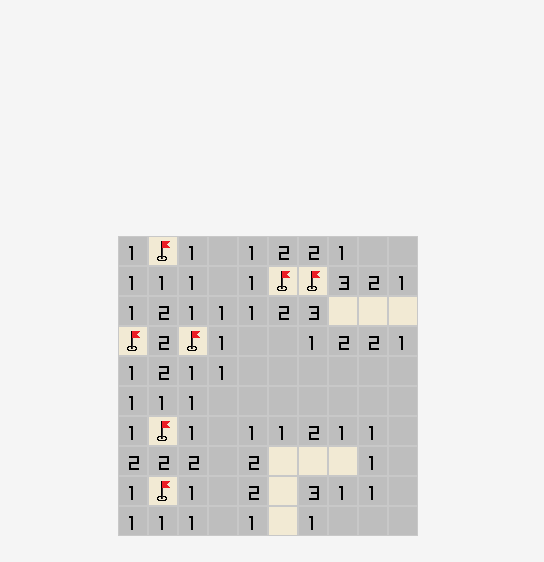

# Minesweeper


A classic Minesweeper game built in C using [raylib](https://www.raylib.com/). Features smooth particle explosion effects, chord-clicking, and a clean game loop with victory/defeat states.

---

## Preview



---

## Features

- 10×10 grid with 12 mines
- **Chord-click** — left-click a revealed number to auto-clear surrounding cells if enough flags are placed
- **Particle explosion** on mine hit — animated burst effect with color gradient
- **First-click safety** — board regenerates until the first click is safe
- Victory and defeat states with visual board reveal
- Flag placement and validation on win/loss

---

## Build

### Requirements

- [CMake](https://cmake.org/) 3.11+
- A C99-compatible compiler (MSVC, GCC, Clang)
- Git (for FetchContent to pull raylib automatically)

### Steps

```bash
git clone https://github.com/xayren/minesweeper.git
cd minesweeper
cmake -B build
cmake --build build
```

The compiled binary and resources will be in the `build/` directory.

```bash
# Run directly
./build/minesweeper        # Linux/macOS
build\minesweeper.exe      # Windows
```

Or use the CMake shortcut:

```bash
cmake --build build --target run
```

> raylib is fetched automatically via CMake FetchContent — no manual installation needed.

---

## How to Play

| Action | Input |
|---|---|
| Reveal cell | Left click |
| Place / remove flag | Right click |
| Chord-click (auto-reveal) | Left click on a revealed number |

- Reveal all non-mine cells to win
- Hitting a mine triggers an explosion and ends the game
- Click **Play Again** to restart

---

## Project Structure

```
minesweeper/
├── src/
│   ├── main.c          # Game loop and state machine
│   ├── minesweeper.c   # Board logic, input handling, rendering
│   └── explosion.c     # Particle system
├── include/
│   ├── types.h         # Shared structs and enums
│   ├── minesweeper.h
│   └── explosion.h
├── resources/          # PNG assets (flag, bomb, trophy, play again)
└── CMakeLists.txt
```

---

## Tech Stack

- **Language:** C99
- **Graphics:** [raylib](https://github.com/raysan5/raylib)
- **Build system:** CMake with FetchContent

---

## License

This project is licensed under the [MIT License](LICENSE).
